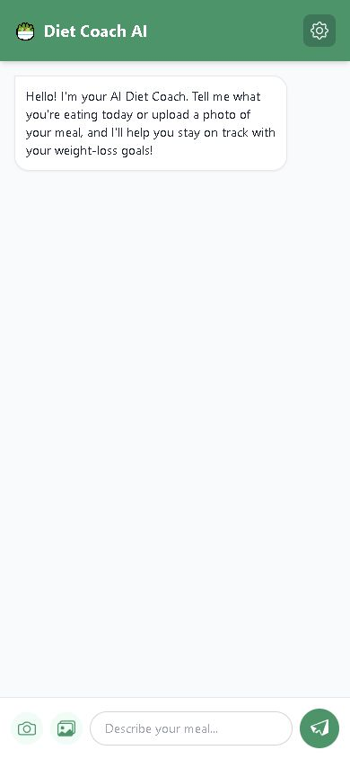

## Diet AI Coach

A mostly client-side JavaScript prototype created to test whether a simple browser interface can provide generative AI features through a cloud-hosted language model.

Public website: [https://hokching.github.io/dietAI/dietAI.html](https://hokching.github.io/dietAI/dietAI.html)

GitHub: [https://github.com/hokching/dietAI](https://github.com/hokching/dietAI)    |    Project status: ongoing prototype

*Mobile view of the single-page prototype. No personal or health data is shown.*

### The question tested

Could a single HTML and JavaScript client support text and image input, a configurable model and system prompt, and cloud-generated responses without building a full application server first?

### What it demonstrates

The prototype shows a low-cost way to test an AI interaction quickly. The interface accepts a meal description or image, prepares a multimodal request and displays the model response. Its configuration can be adjusted for different compatible endpoints and models.

### A deliberate limitation

This architecture is a feasibility test, not a production design. A browser-held API key and client-side request path are not suitable for a public service. A production version would need secure server-side credential handling, authentication, logging, privacy controls and appropriate professional safeguards.

### Why it matters for AI practice

Small prototypes can make an idea concrete for colleagues and reveal technical, security and user-experience issues early. The purpose is not to prove that every idea should be deployed. It is to support a better-informed decision about what to test next.
